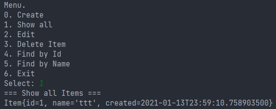
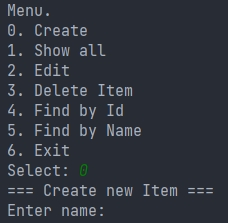
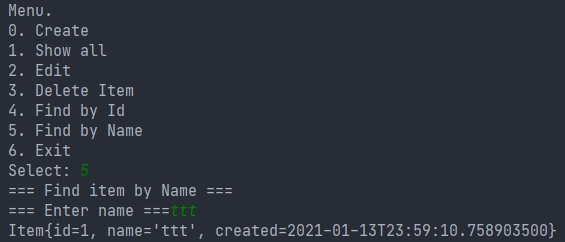

# job4j_tracker

## Используемые технологии

 

 

## Проект содержит решения блоков "ООП", "Collections Lite", "FP,Lambda, Stream API" курса <a href="https://github.com/aswsx/job4j_elementary"> Job4j по основам языка Java</a>.

Основа проекта- консольное приложение для работы с заявками. После запуска на экране отображается меню с выбором доступных действий:
ввод новой заявки, удаление, поиск заявок по ID и имени

  
  
  
  

<h2>Содержимое проекта</h2>
<ul>
  <li>Модель данных <a href="https://github.com/ReyBos/job4j_tracker/blob/master/src/main/java/ru/job4j/tracker/Item.java">ru.job4j.tracker.Item</a> </li>
  <li>Главное меню <a href="https://github.com/ReyBos/job4j_tracker/blob/master/src/main/java/ru/job4j/tracker/StartUI.java">ru.job4j.tracker.StartUI</a></li>
</ul>
<h2>Ключевые этапы</h2>
<ul>
  <li><a href="https://github.com/aswsx/job4j_tracker/commit/e36e582952e28b1635f7c55949ba18cf6990172c">4.1. Разрыв зависимости </a>StartUI от Scanner.</li>
  <li><a href="https://github.com/aswsx/job4j_tracker/commit/ff07445b27e86676e5136f132529a15876791cdc"> Разрыв зависимости </a>StartUI от System.out</li>
  <li><a href="https://github.com/aswsx/job4j_tracker/commit/607689508a2afd6c965d61791b518ba1c7b01357">8. Реализация меню за счет шаблона стратегия.</a>  
Это поведенческий паттерн проектирования, который определяет семейство схожих алгоритмов и помещает каждый из них в собственный класс, 
после чего алгоритмы можно взаимозаменять прямо во время исполнения программы</li>
<li><a href="https://github.com/aswsx/job4j_tracker/commit/5cb1e916a762c7669c8c971944b4e0636a21ddf0">8. Реализация тестов класса StartUI.</a>
  <li><a href="https://github.com/aswsx/job4j_tracker/commit/0e7196163b014a00dc8ad29f84f6ee405f007a36">Рефакторинг - Шаблон Декоратор для валидатора.</a> 
Декоратор — это структурный паттерн проектирования, который позволяет динамически добавлять объектам новую функциональность, оборачивая их в полезные «обёртки».</li>
  <li>Шаблон фабричный метод. Смысл этого шаблона в создании метода, который создает новый экземпляр объекта.Шаблон абстрактная фабрика.
Главное отличие от фабричного метода, абстрактная фабрика это интерфейс, который содержит абстрактные методы для создания экземпляров. 
Шаблон Фабричный метод применяется в классах CreateAction, DeleteAction, EditAction, FindAction. 
В этих методах возможно применить шаблон Абстрактная фабрика, есл переместить метод execute() в интерфейс UserAction</li>
<li>Подключение Checkstyle с Maven  </li>
  <li>JaCoCo. Процент покрытие тестами </li>
  <li>Интеграция с Travis CI </li>
  <li>Лямбда выражения </li>
  <li>StreamAPI </li>
  <li>Optional </li>
  <li>Local-Variable Type Inference (var) </li>

<h3>Singleton</h3>

<a href="https://github.com/aswsx/job4j_tracker/commit/1738ebf1c2c56a6c81cbd235147b34e2ba40eaa3">Шаблон singleton</a> -
используется для создания класса, который может содержать только один экземпляр объекта в виртуальной машине. Шаблон
singleton применять в проектах, где используются работы с внешними ресурсами: базы данных, серверы. Шаблон может быть
с ленивой и энергичной загрузкой.

<ul>
  <li>Ленивая загрузка (Lazy loading) происходит, когда мы первый раз явно обращаемся к объекту.</li>
  <li>Энергичная загрузка (Eager loading) - загружает объект сразу после старта виртуальной машины.</li>
</ul>
<h4>Представлены следующие варианты реализации</h4>
<ol>
  <li><a href="https://github.com/aswsx/job4j_tracker/blob/1738ebf1c2c56a6c81cbd235147b34e2ba40eaa3/src/main/java/ru/job4j/tracker/TrackerEnum.java">Enum</a>. Eager loading.</li>
  <li><a href="https://github.com/aswsx/job4j_tracker/blob/1738ebf1c2c56a6c81cbd235147b34e2ba40eaa3/src/main/java/ru/job4j/tracker/TrackerStaticFieldLazy.java">static field</a>. Lazy loading.</li>
  <li><a href="https://github.com/aswsx/job4j_tracker/blob/1738ebf1c2c56a6c81cbd235147b34e2ba40eaa3/src/main/java/ru/job4j/tracker/TrackerStaticFieldEager.java">static final field</a>. Eager loading.</li>
  <li><a href="https://github.com/aswsx/job4j_tracker/blob/1738ebf1c2c56a6c81cbd235147b34e2ba40eaa3/src/main/java/ru/job4j/tracker/TrackerStaticClassLazy.java">private static final class</a>. Lazy loading.</li>
</ol>

